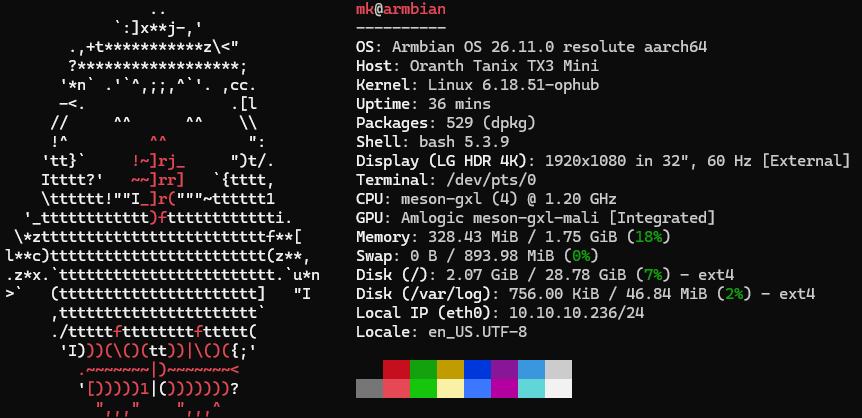

# Tanix_TX3_mini

Document a modern Linux on my old TV boxes.

Now it is very well supported, no longer limited to 32bit. But it's not directly to be found on Armbian, its done by the ophub project:

[https://github.com/ophub/amlogic-s9xxx-openwrt](https://github.com/ophub/amlogic-s9xxx-openwrt)
Strange, I got them in 2018, by 2020 it looked like no newer kernels would be released (balbes150 had stopped working) and in 2026 I figure out the newest kernels are running! in 64 bit, and increasing support for the hardware! 

```text
    _             _    _              ___  ___
   /_\  _ _ _ __ | |__(_)__ _ _ _    / _ \/ __|
  / _ \| '_| '  \| '_ \ / _` | ' \  | (_) \__ \
 /_/ \_\_| |_|_|_|_.__/_\__,_|_||_|  \___/|___/

 v26.11.0 for Aml.S905w running Armbian Linux 6.18.51-ophub

 Packages:     Ubuntu stable (resolute)
 IPv4:        (LAN) 10.10.10.236, 10.8.8.184

 Performance:

 Load:         15%               Uptime:         1m
 Memory usage: 12% of 1.75G
 CPU temp:     53°C              Usage of /:   16% of 14G

 Commands:

 Configuration: armbian-config
 Monitoring   : htop

Last login: Mon Sep 21 18:03:13 2026 from 10.10.10.30
```

And the result of `fastfetch` is



## Android update

The old box was still running on Android 7.1.2 (April 2, 2017) but Tanix actually provided an update in 2022.11.23 to 8.1 (December 2017). It might not have some of the observed challenges, but how to update? AI recommends an USB-A to USB-A cable. Well, it works without:

- Get the latest firmware at [https://www.tanixtvbox.com/firmware-centre/](https://www.tanixtvbox.com/firmware-centre/)
  - [Link to a Google Drive file 1.4 GByte](https://drive.google.com/file/d/1sxcA-HAjXOF5-EyaQEqxpZLGZw043DOU/view)
- Get the [Amlogic Bootcard Maker](https://wiki.coreelec.org/coreelec:aml_burncard) - see info at CoreELEC Wiki
  - [Version 1.01, 2.0.2 and 2.0.3 on MEGA](https://mega.nz/folder/7o8FUYKB#KBSDkWXzz6T6gqym68j2ww)
- Format a microSD card to FAT32, start the program
- It copies the img with a few other files to the card
- Put SD card into Tanix TX3 mini, hold the reset button (needle from below) and power the system on. Release the button after 10 seconds
- Android System shows a green Android and a progress bar

Done.

## Support for Armbian

Don't go to the Armbian page - the Tanix is not listed. The forum is misleading. The images are available from [ophub.org](https://github.com/ophub) at their [respective Github page](https://github.com/ophub/amlogic-s9xxx-armbian) with the [latest releases](https://github.com/ophub/amlogic-s9xxx-armbian/releases). In my case, resolut racoon, the 26.04 LTS edition of Ubuntu and a 6.18.51 kernel.
